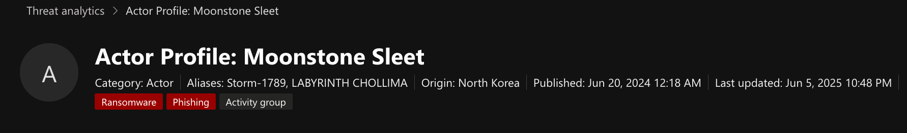
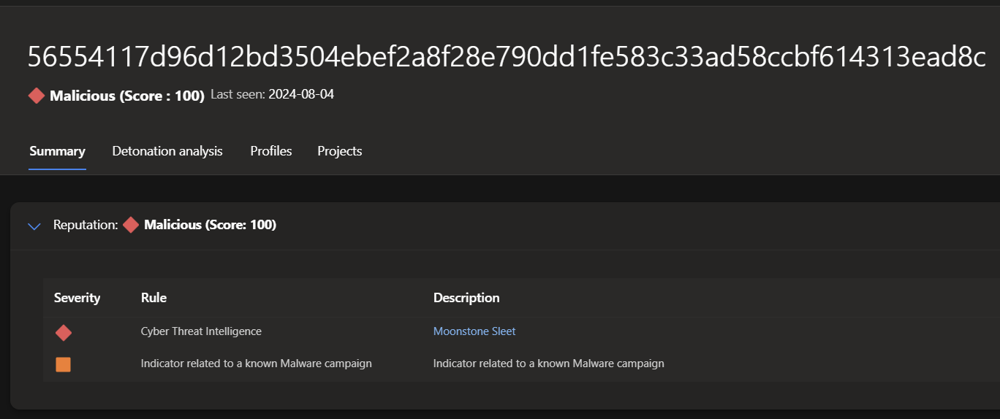
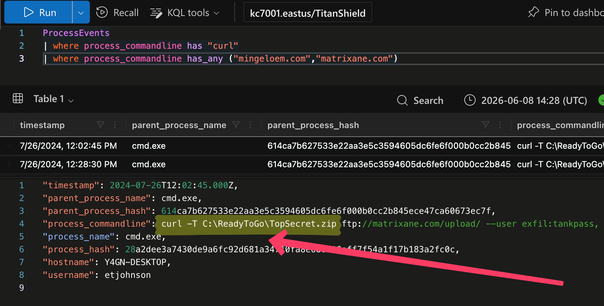
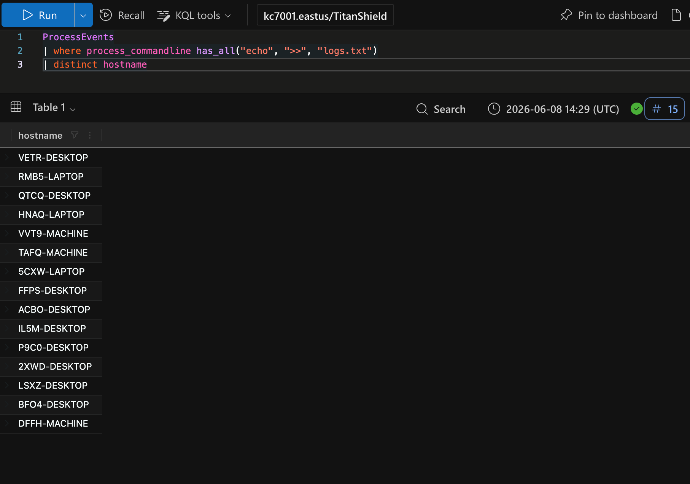
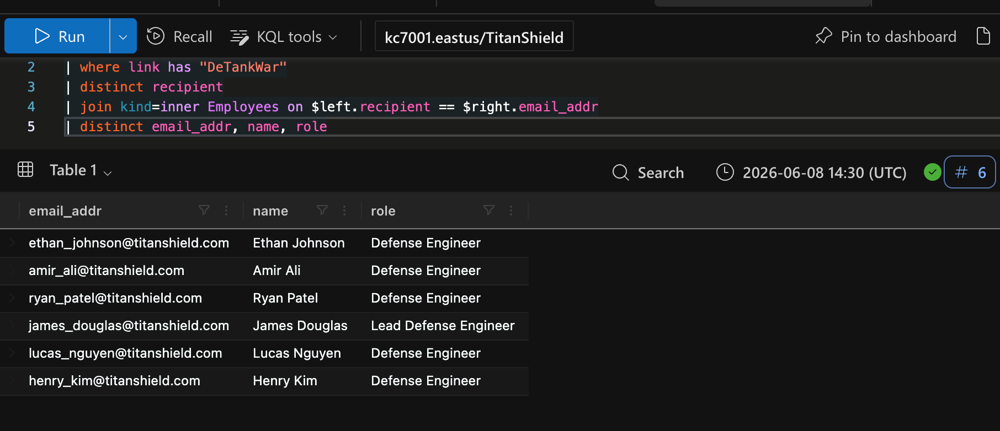
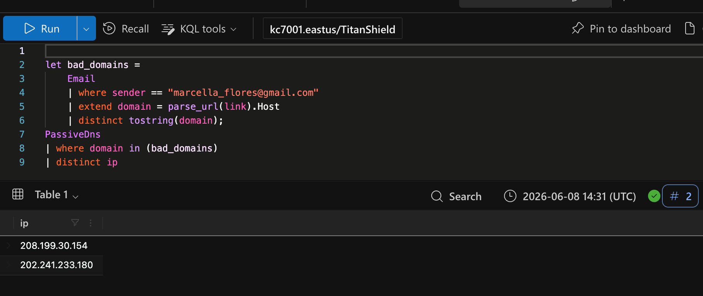
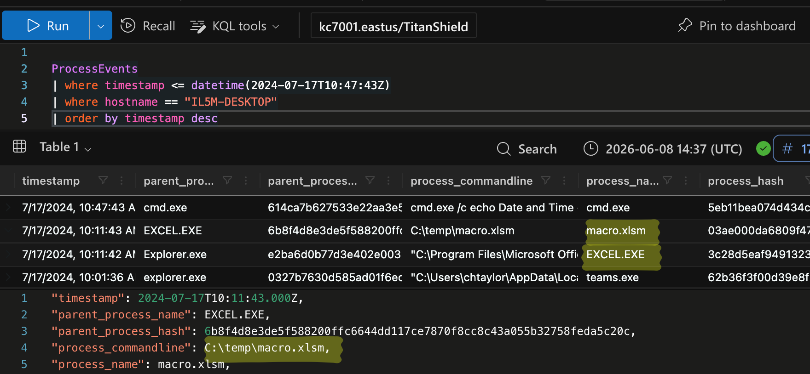
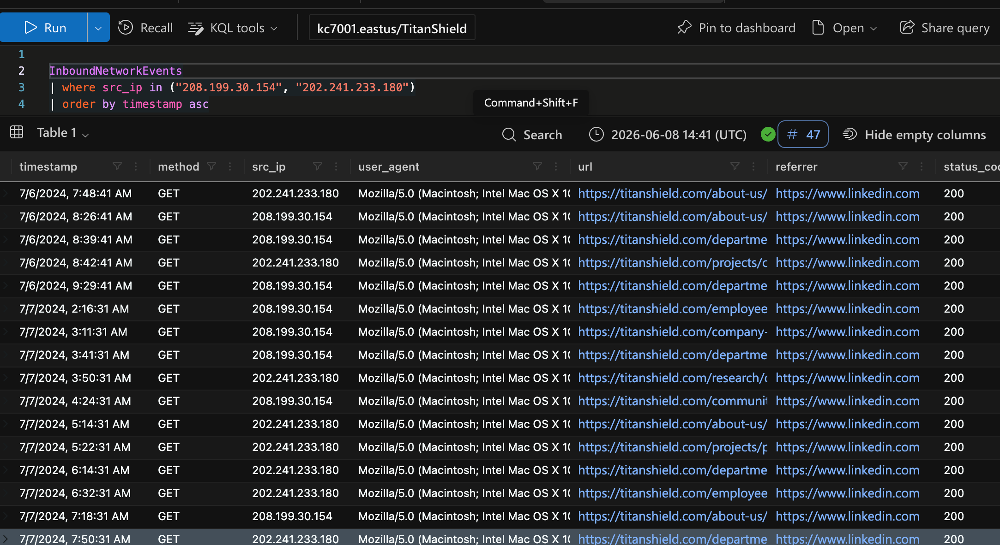
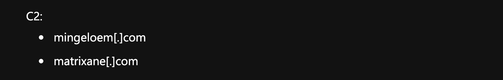

# Defender XDR Hunting North Korean Threat Actors

**Uncovering Nation-State Attacks with Microsoft Defender XDR**

Full-scale investigation and attribution of **Moonstone Sleet** (North Korea-linked) and **Crimson Sandstorm** using Microsoft Defender XDR Advanced Hunting.

> **Platform:** KC7 Cyber (Microsoft-sponsored)  
> **Tools used:** Microsoft Defender XDR · Advanced Hunting (KQL) · Defender Threat Intelligence · Passive DNS  
> **Threat actors identified:** Moonstone Sleet · Crimson Sandstorm (Curium)  
> **Status:** Investigation complete

---

## Overview

TitanShield is a defense contractor running a classified program called **Project Omega**. This case documents a full investigation into a multi-stage intrusion — from LinkedIn reconnaissance through phishing delivery, malware execution, lateral spread across 15 hosts, and confirmed data exfiltration.

---

## Attack Summary

| Stage              | What happened |
|--------------------|---------------|
| Reconnaissance     | Threat actor IPs scanned the company from Jul 5 — targeting employees via LinkedIn |
| Initial access     | Phishing email with malicious Excel file delivered to Defense Engineers |
| Execution          | Macro dropped malicious DLLs |
| Discovery          | 39 recon commands logging system info |
| Lateral movement   | Same pattern found across **15 distinct hosts** |
| Collection         | Project Omega files staged and compressed |
| Exfiltration       | Data sent via FTP to external server |
| Second vector      | Separate Moonstone Sleet campaign via fake tank game |

---

## Key KQL Techniques Demonstrated
- `join kind=inner` across `Email` and `Employees` tables to map phishing targets to job roles
- `let` variable + `in` operator for domain → IP pivoting using Passive DNS
- `has_all()` to fingerprint specific attacker command patterns
- `parse_url().Host` for domain extraction and threat intelligence lookup
- Timeline reconstruction using `order by timestamp`

---

## Threat Actor Attribution

**Moonstone Sleet**  
- Linked to: `detankwar[.]com`, malicious DLLs (`NVUnityPlugin.dll`)
- Vector: Fake tank game distributed via phishing
- Attribution confirmed via Defender XDR Threat Intelligence

**Crimson Sandstorm (Curium)**  
- Used phishing emails from `marcella_flores[.]gmail[.]com`
- Infrastructure: IPs `208.199.30.154` and `202.241.233.180`
- Exfiltrated data sent to: `exfilbucket93[.]gmail[.]com`
- Attribution confirmed via Passive DNS + Defender Threat Intelligence

  ## Investigation Walkthrough

**00. Moonstone Sleet Actor Profile**  

**1. Moonstone Sleet Threat Intelligence Attribution**  

**2. FTP Exfiltration Command – The Smoking Gun**  
 

**3. Lateral Movement Across 15 Hosts**  

**4. Precision Targeting of Defense Engineers**  

**5. Passive DNS Pivot – Resolving Attacker IPs**  

**6. Full Kill Chain Timeline Reconstruction**  

**7. Inbound Reconnaissance & LinkedIn Activity**  

**8. C2 Domains Used by the Actor**  

---

## Skills Demonstrated
`KQL Advanced Hunting` · `Microsoft Defender XDR` · `Threat Intelligence` · `Passive DNS` · `Kill Chain Analysis` · `Threat Actor Attribution` · `Incident Investigation`

---

## Platform
[KC7 Cyber](https://kc7cyber[.]com) — Titan Shield module (Microsoft-sponsored)

*This investigation was conducted in a simulated environment on the KC7 Cyber platform. No real systems were accessed.*

---

**Author**: Mohamed Khaled 
**Date**: Feb 2026
